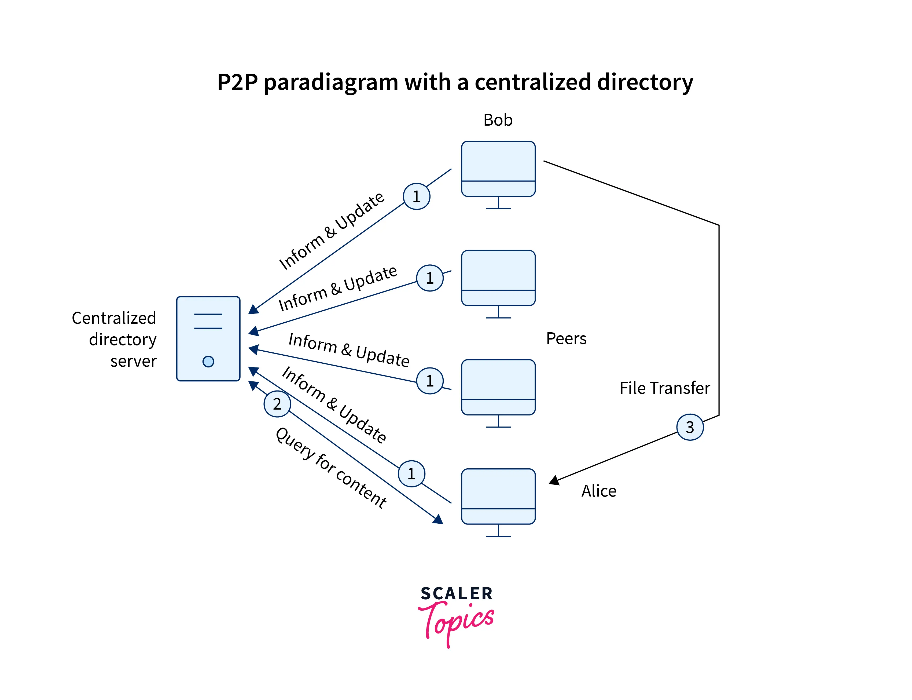

# Minitorr: Peer2Peer-Group-based-File-system

## Description

This project is a peer-to-peer file sharing network that enables users to share, download, and remove files from the group they belong to. Download happens parallelly with multiple pieces from multiple peers. It follows a similar concept to popular file sharing protocols like BitTorrent found on the internet.

The architecture of this Mini-Torr project consists of multiple clients (users) and a tracker. The tracker plays a crucial role in maintaining the network by storing metadata related to the files and users. Specifically, the tracker maintains a mapping of files to the users who possess them. This mapping helps clients discover other users who have the desired files they wish to download.



## Functional Requirements

The network for the Mini-torrent project will consist of the following entities:

1. Tracker(Centralized Server):
   - Maintain information of clients with their files (shared by client) to assist the clients for communication between peers.
   - Tracker should be online all the time.

2. Clients:
   - Users should create an account and register with the tracker.
   - Login using the user credentials.
   - Create a group and become the owner of that group.
   - Fetch a list of all groups in the server.
   - Request to join a group.
   - Leave a group.
   - Accept group join requests (if the client is the owner).
   - Share a file across the group: Share the filename and SHA1 hash of the complete file, as well as piecewise SHA1, with the tracker.
   - Fetch a list of all shareable files in a group.
   - Download a file:
     - Retrieve peer information from the tracker for the file.
     - **Core Part**: Download the file from multiple peers simultaneously, obtaining different pieces of the file from different peers (using a piece selection algorithm).
     - All downloaded files by the client will be shareable to other users in the same group.
     - Ensure file integrity through **SHA1** comparison.
   - Show ongoing downloads.
   - Stop sharing a file.
   - Stop sharing all files (Logout).
   - Whenever a client logs in, all previously shared files before logout should automatically be in sharing mode.


## Compile Code

- Open the /client folder in the terminal and run the following command to compile:

```shell
g++ client.cpp -o client -lpthread -lssl -lcrypto
```

- Open the /tracker folder in the terminal and run the following command to compile:
```shell
g++ tracker.cpp -o tracker -lpthread
```

- Put a `tracker_info.txt` file in /client and /tracker which contains tracker IP and port numbers on different lines. The format should be as follows:

```shell
Ex:
127.0.0.1
5000
127.0.0.1
6000
```


## Commands

- **Important**: Put client and tracker compiled executable file in ame folder along with `tracker_info.txt`

- Run Tracker first with
```shell
./tracker tracker_info.txt
```
- Run client by providing IP and PORT of the client. You can open multiple clients by providing multiple ports(different for each user).
```shell
./client <IP>:<PORT> tracker_info.txt
```
**Note**: Adviced to use `127.0.0.1` as common IP in clients


## Client Commands

Commands:

1. Create User Account:
 `create_user <user_id> <password>`

2. Login: 
`login <user_id> <password>`

3. Create Group: 
`create_group <group_id>`

4. Join Group: 
`join_group <group_id>`

5. Leave Group: 
`leave_group <group_id>`

6. List Pending Join: 
`list_requests <group_id>`

7. Accept Group Joining Request: 
`accept_request <group_id> <user_id>`

8. List All Groups in Network: 
`list_groups`

9. List All Sharable Files in Group: 
`list_files <group_id>`

10. Upload File: 
`upload_file <file_path> <group_id>`

11. Download File: 
`download_file <group_id> <file_name> <destination_path>`

12. Logout: 
`logout`

13. Show Downloads: 
`show_downloads`

   - Output format: `[D] [grp_id] filename` or `[C] [grp_id] filename` (D - Downloading, C - Complete)
14. Stop Sharing:
 `stop_share <group_id> <file_name>`


## Implementation Details

### Socket Programming

Socket programming is employed in this Mini-Torr project to establish communication channels between the tracker and clients. Both the tracker and client continuously listen for incoming requests, enabling seamless data exchange and coordination within the peer-to-peer network.

### Multithreading

To facilitate parallel downloads and enhance performance, multithreading is utilized in the project. Each download request is assigned to a separate thread, allowing multiple file pieces to be downloaded simultaneously from different peers. This approach significantly improves the download speed and efficiency of the Mini-torrent system.

### SHA1

The SHA1 algorithm is employed to maintain data integrity within the Mini-torrent network. Chunkwise hashing using SHA1 ensures that downloaded file pieces match their corresponding checksums. By comparing the computed SHA1 hash with the expected value, the system verifies that the downloaded data has not been tampered with or corrupted during the transfer process. This integrity check mechanism helps guarantee the reliability and authenticity of shared files in the Mini-torrent network.

### Piece Selection Algorithm

- Ask Tracker to give file-peer information(i.e which peers has pieces of that file)
- Once we have the peers/clients info we connect with each peer and ask which Chunks does the peer have. Peer responds with chunk numbers it possess.
- Now, we have chunk to peer mapping(i.e for some chunk, which all peers possess it), We will take random peer and ask for that chunk.
- After downloading a chunk, if the SHA/hash matches, it is taken.
- At the end it will be checked if all the Chunks are present or not. If not, we will do the above steps again one more time, if any chunk is not having a peer that means it cannot be downloaded completely.

**NOTE** : Here Peer corresponds to Client which in turn corresponds to PORT.

# Contribution

Any Contributions are most welcome. Feel free to play around the notebook and suggest changes.

